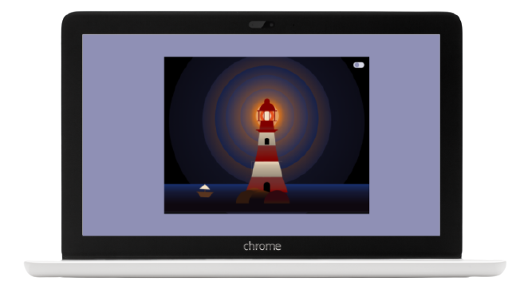

# **Lighthouse**

This is a LightHouse CSS animation developed with [](https://html.spec.whatwg.org/) [](https://www.w3.org/Style/CSS/)  [](https://sass-lang.com/) and [](https://www.ecma-international.org/ecma-262/)

Project inspired by a [**CSS Animation video tutorial**](https://www.youtube.com/watch?v=uzuqsxua89k).

**[Project URL](https://anaguerraabaroa.github.io/lighthouse/)** is available on GitHub Pages.

### Installation

- Clone repository:

```
git clone [repository]
```

- Run project on local server with VSCode live server plugin.

## **Folder Structure**

```
LightHouse
├── audio
│   └── waves.mp3
├── images
│   ├── favicon.svg
│   └── lighthouse_css_animation.png
├── js
│   └── main.js
├── styles
│   └── main.css
├── index.html
├── LICENSE
└── README.md
```

## **License**

This project is licensed under 
